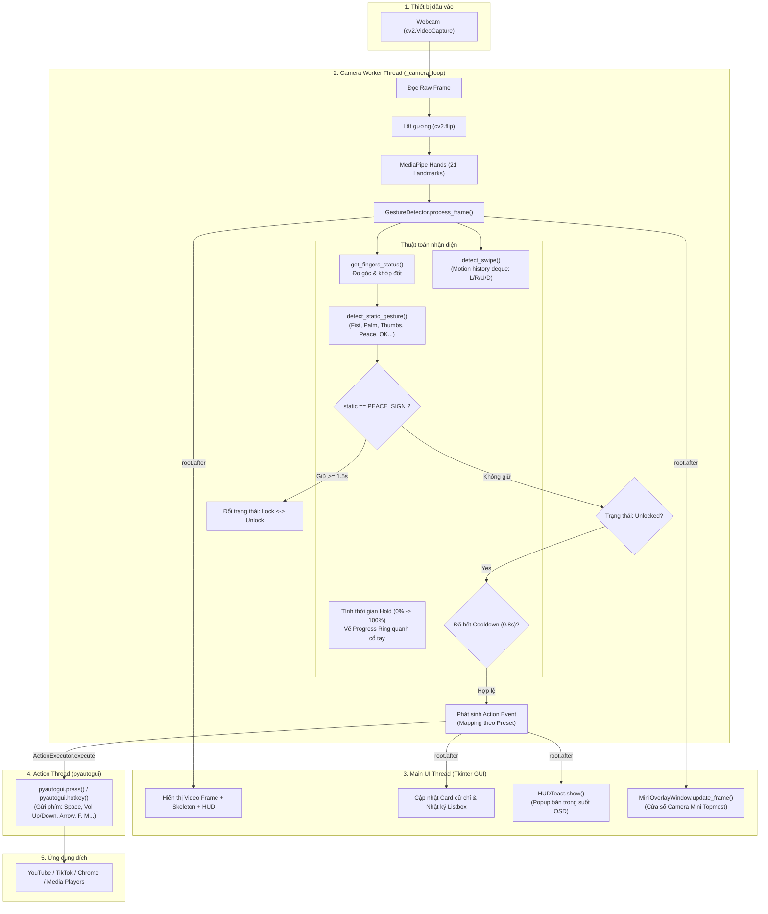

# 📘 BÁO CÁO PHÂN TÍCH TOÀN DIỆN KIẾN TRÚC & TỪNG FILE DỰ ÁN
## 🖐️ AI GESTURE MEDIA CONTROLLER (DESKTOP APPLICATION)

---

## 📑 MỤC LỤC
1. [Tổng Quan Kiến Trúc Hệ Thống (Architecture & Data Flow)](#1-tổng-quan-kiến-trúc-hệ-thống)
2. [Bảng Tổng Hợp Danh Mục Các File](#2-bảng-tổng-hợp-danh-mục-các-file)
3. [Phân Tích Chi Tiết Từng File Trong Dự Án](#3-phân-tích-chi-tiết-từng-file-trong-dự-án)
   - [3.1. `main.py` - Điểm khởi động ứng dụng (Entry Point)](#31-mainpy)
   - [3.2. `app_gui.py` - Giao diện đồ họa chính (Modern Light GUI)](#32-app_guipy)
   - [3.3. `gestures.py` - Bộ nhận diện cử chỉ AI (Gesture Detector)](#33-gesturespy)
   - [3.4. `action_executor.py` - Bộ thực thi lệnh phím tắt (Action Executor)](#34-action_executorpy)
   - [3.5. `config.py` - Trình quản lý cấu hình & Presets (Config Manager)](#35-configpy)
   - [3.6. `gesture_config.json` - Tệp lưu trữ cấu hình cố định](#36-gesture_configjson)
   - [3.7. `hud.py` - Cửa sổ thông báo trực quan (Visual Feedback Toast / HUD)](#37-hudpy)
   - [3.8. `overlay.py` - Cửa sổ Camera Mini luôn nổi (Mini Live Preview)](#38-overlaypy)
   - [3.9. `main_legacy.py` - Phiên bản thuật toán mẫu sơ khai](#39-main_legacypy)
   - [3.10. `requirements.txt` - Danh sách thư viện phụ thuộc](#310-requirementstxt)
   - [3.11. `setup_env.bat` - Kịch bản tự động cài đặt môi trường](#311-setup_envbat)
   - [3.12. `run_app.bat` - Kịch bản khởi chạy ứng dụng nhanh](#312-run_appbat)
   - [3.13. `README.md` - Tài liệu hướng dẫn sử dụng dự án](#313-readmemd)
   - [3.14. `UI_LIGHT_PROMPT.md` - Đặc tả thiết kế giao diện Clean Tech Light Theme](#314-ui_light_promptmd)
4. [Các Cơ Chế Kỹ Thuật Nổi Bật & Tối Ưu Hệ Thống](#4-các-cơ-chế-kỹ-thuật-nổi-bật--tối-ưu-hệ-thống)
5. [Hướng Dẫn Mở Rộng & Nâng Cấp Tương Lai](#5-hướng-dẫn-mở-rộng--nâng-cấp-tương-lai)

---

## 1. TỔNG QUAN KIẾN TRÚC HỆ THỐNG

Dự án **AI Gesture Media Controller** là một ứng dụng Desktop hoàn chỉnh viết bằng **Python**, kết hợp giữa:
- **Thị giác máy tính (Computer Vision)**: Google MediaPipe Hands và OpenCV để phát hiện 21 điểm mốc khớp xương bàn tay (Hand Landmarks) trong không gian 2D/3D theo thời gian thực.
- **Thuật toán hình học & Phân tích chuyển động**: Giải thuật tính toán khoảng cách Euclid chuẩn hóa và hàng đợi trượt (Sliding Window / `deque`) để nhận diện cử chỉ tĩnh lẫn cử chỉ động (vuốt/gạt tay).
- **Điều khiển hệ điều hành (OS Automation)**: Thư viện `pyautogui` mô phỏng phím bấm và tổ hợp phím hệ thống trong luồng chạy ngầm riêng biệt.
- **Giao diện người dùng hiện đại (Modern GUI)**: Xây dựng trên `tkinter` / `ttk` theo phong cách Clean Tech Light Theme (phong cách macOS/Notion/Vercel), hỗ trợ DPI Awareness trên Windows, cửa sổ OSD Toast Glassmorphism không cướp focus, và cửa sổ Mini Camera Overlay kéo thả linh hoạt.

### 🔄 Sơ đồ luồng dữ liệu thời gian thực (Data Flow Diagram)

---

## 2. BẢNG TỔNG HỢP DANH MỤC CÁC FILE

| STT | Tên Tệp | Định Dạng / Kích Thước | Vai Trò Chính Trong Hệ Thống |
| :---: | :--- | :---: | :--- |
| 1 | [`main.py`](file:///D:/DuAnAI_Backup/main.py) | Python (~1.3 KB, 41 dòng) | Điểm khởi chạy (Entry Point), thiết lập Windows High-DPI Awareness và khởi chạy GUI. |
| 2 | [`app_gui.py`](file:///D:/DuAnAI_Backup/app_gui.py) | Python (~48.4 KB, 1271 dòng) | Trọng tâm giao diện người dùng Tkinter: Camera Loop, Dashboard, Ánh xạ phím, Quản lý luồng. |
| 3 | [`gestures.py`](file:///D:/DuAnAI_Backup/gestures.py) | Python (~16.2 KB, 359 dòng) | Bộ nhận diện cử chỉ MediaPipe: Xử lý 21 Landmarks, cử chỉ tĩnh/động, Hold-to-Lock, Cooldown. |
| 4 | [`action_executor.py`](file:///D:/DuAnAI_Backup/action_executor.py) | Python (~1.8 KB, 52 dòng) | Trình thực thi phím bấm bất đồng bộ (PyAutoGUI worker thread) đảm bảo UI không giật lag. |
| 5 | [`config.py`](file:///D:/DuAnAI_Backup/config.py) | Python (~8.1 KB, 135 dòng) | Module định nghĩa hằng số, Presets mặc định, từ điển cử chỉ và hàm đọc/ghi `gesture_config.json`. |
| 6 | [`gesture_config.json`](file:///D:/DuAnAI_Backup/gesture_config.json) | JSON (~8.9 KB, 235 dòng) | File lưu trữ cấu hình cố định (Persistent State): phím tắt, độ nhạy, camera, preset đang chọn. |
| 7 | [`hud.py`](file:///D:/DuAnAI_Backup/hud.py) | Python (~3.8 KB, 104 dòng) | Cửa sổ thông báo bán trong suốt dạng Toast/OSD nổi trên góc màn hình desktop. |
| 8 | [`overlay.py`](file:///D:/DuAnAI_Backup/overlay.py) | Python (~4.8 KB, 135 dòng) | Cửa sổ Camera Mini luôn nổi (Always on Top), không viền, hỗ trợ kéo thả tự do. |
| 9 | [`main_legacy.py`](file:///D:/DuAnAI_Backup/main_legacy.py) | Python (~4.6 KB, 133 dòng) | Bản code thuật toán sơ khai độc lập chạy bằng cửa sổ OpenCV cv2.imshow để đối chiếu. |
| 10 | [`requirements.txt`](file:///D:/DuAnAI_Backup/requirements.txt) | Text (~610 B, 36 dòng) | Khai báo các thư viện Python bắt buộc và phiên bản chính xác đã đóng gói. |
| 11 | [`setup_env.bat`](file:///D:/DuAnAI_Backup/setup_env.bat) | Batch Script (~1.3 KB, 48 dòng) | Script cài đặt môi trường tự động: Kiểm tra Python, tạo `venv`, nâng cấp pip, cài dependencies. |
| 12 | [`run_app.bat`](file:///D:/DuAnAI_Backup/run_app.bat) | Batch Script (~358 B, 14 dòng) | Script khởi động ứng dụng chỉ với 1 click, tự động bắt đúng Python trong `venv`. |
| 13 | [`README.md`](file:///D:/DuAnAI_Backup/README.md) | Markdown (~6.3 KB, 101 dòng) | Hướng dẫn sử dụng tổng quát, danh sách cử chỉ YouTube/TikTok và hướng dẫn cài đặt. |
| 14 | [`UI_LIGHT_PROMPT.md`](file:///D:/DuAnAI_Backup/UI_LIGHT_PROMPT.md) | Markdown (~4.8 KB, 72 dòng) | Bản đặc tả thiết kế giao diện Clean Tech Light Theme quy định bảng màu và layout. |
| 15 | [`mouse_controller.py`](file:///D:/DuAnAI_Backup/mouse_controller.py) | Python (~8.8 KB, 250 dòng) | Module Chuột Ảo (Air Mouse): Khử rung EMA thích ứng, Position Freeze khi click, Hộp tương tác ảo ROI. |

---

## 3. PHÂN TÍCH CHI TIẾT TỪNG FILE TRONG DỰ ÁN

---

### 3.1. `main.py`
- **Đường dẫn**: [`main.py`](file:///D:/DuAnAI_Backup/main.py)
- **Kích thước**: 41 dòng | 1,314 bytes
- **Mục đích**: Là tệp điểm vào (Entry Point) của toàn bộ hệ thống. Nhiệm vụ chính là khởi tạo môi trường hiển thị hệ điều hành tối ưu trước khi nạp đồ họa Tkinter.

#### Các thành phần chính:
1. **`enable_windows_dpi_awareness()`**:
   - Sử dụng thư viện `ctypes` can thiệp trực tiếp vào Windows Win32 API (`ctypes.windll.shcore.SetProcessDpiAwareness(1)` hoặc fallback sang `ctypes.windll.user32.SetProcessDPIAware()`).
   - *Ý nghĩa kỹ thuật*: Khắc phục hiện tượng chữ, icon và hình vẽ bị mờ/nhòe (blurry/scaled) do cơ chế tự phóng to DPI mặc định trên Windows màn hình 2K, 4K hoặc tỉ lệ hiển thị 125%, 150%.
2. **`main()`**:
   - Khởi tạo gốc giao diện `root = tk.Tk()`.
   - Đặt tiêu đề cửa sổ: `"AI Gesture Media Controller - Trợ Lý Điều Khiển Cử Chỉ"`.
   - Tạo đối tượng trung tâm `ModernGestureApp(root)`.
   - Kích hoạt vòng lặp xử lý sự kiện `root.mainloop()`.

---

### 3.2. `app_gui.py`
- **Đường dẫn**: [`app_gui.py`](file:///D:/DuAnAI_Backup/app_gui.py)
- **Kích thước**: 1,271 dòng | 48,366 bytes
- **Mục đích**: Trọng tâm điều khiển toàn bộ trải nghiệm người dùng (GUI Controller). Đảm nhận kết nối các tầng: Tầng xử lý Camera -> Tầng nhận diện AI -> Tầng bắn phím tắt -> Tầng hiển thị giao diện Desktop hiện đại.

#### Kiến trúc giao diện & Thành phần (`class ModernGestureApp`):
1. **Quản lý Vòng đời & Luồng Camera (`_camera_loop`, `start_camera`, `stop_camera`, `toggle_camera`)**:
   - Camera được đọc trong một luồng riêng (`threading.Thread(target=self._camera_loop, daemon=True)`), sử dụng backend `cv2.CAP_DSHOW` của Windows để mở camera nhanh tức thì mà không bị trễ.
   - Tính toán chỉ số khung hình thực tế (`FPS`) và truyền dữ liệu frame đã xử lý về main thread thông qua `self.root.after(0, ...)`.
2. **Cấu trúc Bố cục 2 Cột chuẩn Desktop App**:
   - **Thanh Header trên cùng (`_create_header`)**:
     - Hiển thị logo, tiêu đề hệ thống.
     - Combobox chuyển đổi nhanh giữa 3 bộ Preset: `youtube`, `tiktok`, `custom`.
     - Nút trạng thái Khóa / Mở khóa nhanh (màu xanh lá khi Active, đỏ nhạt khi Locked).
     - Nút Bật / Dừng Camera.
   - **Cột bên trái (Camera Live Preview)**:
     - Khung hiển thị hình ảnh webcam tỷ lệ chuẩn, có khung xương tay (Hand Skeleton) và thanh thông tin OSD.
     - Huy hiệu FPS dạng viên thuốc (Pill Badge).
     - Các nút tiện ích: Mở cửa sổ Mini Overlay luôn nổi, Checkbox Lật gương (Mirror), Checkbox Ẩn/Hiện khung xương tay.
   - **Cột bên phải (Hệ thống Tabs - `ttk.Notebook`)**:
     - **Tab 1: Bảng Điều Khiển (`_build_dashboard_tab`)**: Hai thẻ trạng thái lớn (Cử chỉ đang bắt được và Lệnh gửi gần nhất), thanh trạng thái Cooldown, khung gợi ý nhanh danh sách cử chỉ của chế độ hiện tại, và hộp danh sách nhật ký lệnh theo thời gian thực (`Listbox` có thanh cuộn).
     - **Tab 2: Ánh Xạ Cử Chỉ (`_build_mappings_tab`)**: Bảng `ttk.Treeview` hiển thị toàn bộ cử chỉ kèm icon, tên hành động, phím tắt hệ thống và mô tả chi tiết; tích hợp bộ form chỉnh sửa động (Edit Box) cho phép người dùng click vào cử chỉ bất kỳ và đổi phím bấm theo ý thích; nút khôi phục preset gốc.
     - **Tab 3: Cài Đặt Hệ Thống (`_build_settings_tab`)**: Chọn cổng Camera (Index 0, 1, 2...), 4 thanh trượt tùy biến độ nhạy (Cooldown 0.3s - 2.5s, Hold Lock Time 1.0s - 3.0s, MediaPipe Confidence 0.5 - 0.95, Swipe Threshold 0.08 - 0.25), Checkbox bật/tắt HUD Toast, nút lưu toàn bộ cấu hình và nút Reset Factory.
3. **An toàn đa luồng (Thread-safety)**:
   - Toàn bộ các thao tác cập nhật giao diện Tkinter (`lbl_video`, `lbl_current_gesture`, `lbl_last_action`, `log_listbox`, `hud_toast.show`) đều được bọc qua `root.after(0, ...)`, triệt tiêu hoàn toàn lỗi xung đột luồng (`Tcl_AsyncDelete` hoặc crash GUI).

---

### 3.3. `gestures.py`
- **Đường dẫn**: [`gestures.py`](file:///D:/DuAnAI_Backup/gestures.py)
- **Kích thước**: 359 dòng | 16,152 bytes
- **Mục đích**: "Bộ não AI" của dự án, chứa toàn bộ thuật toán phân tích hình thái học bàn tay từ MediaPipe Hands, nhận diện cử chỉ tĩnh/động, cơ chế giữ để khóa an toàn (Hold-to-Lock) và bộ đếm Cooldown.

#### Chi tiết các thuật toán cốt lõi (`class GestureDetector`):
1. **Chuẩn hóa kích thước bàn tay (`get_palm_size`)**:
   - Đo khoảng cách Euclid 2D giữa cổ tay (`Landmark 0`) và gốc ngón giữa (`Landmark 9`).
   - *Mục đích*: Làm thước đo cơ sở chuẩn hóa (Normalized Scale). Nhờ đó, người dùng đứng gần hay xa webcam thì các ngưỡng nhận diện vẫn hoạt động chính xác tương đương.
2. **Xác định trạng thái mở/cụp của 5 ngón tay (`get_fingers_status`)**:
   - Trả về mảng nhị phân 5 phần tử: `[thumb, index, middle, ring, pinky]` (1 là mở, 0 là gập).
   - **Ngón cái (Thumb - ID 4)**: So sánh khoảng cách từ đầu ngón cái (`Landmark 4`) đến gốc ngón út (`Landmark 17`) và khoảng cách từ khớp đốt 2 ngón cái (`Landmark 2`) đến gốc ngón út, kết hợp độ vươn xa so với cổ tay. Cách tiếp cận này loại bỏ hoàn toàn nhược điểm so sánh tọa độ X đơn thuần vốn bị sai lệch khi nghiêng bàn tay.
   - **4 ngón còn lại (Index: 8, Middle: 12, Ring: 16, Pinky: 20)**: So sánh khoảng cách từ đầu ngón đến cổ tay (`Landmark 0`) với khớp đốt giữa (`PIP`) đến cổ tay.
3. **Nhận diện cử chỉ tĩnh (`detect_static_gesture`)**:
   - `OPEN_PALM`: Xòe bàn tay (tổng số ngón mở $\ge 4$).
   - `FIST`: Nắm đấm (tổng số ngón mở $= 0$).
   - `PEACE_SIGN`: Chữ V (ngón trỏ và ngón giữa mở, 2 ngón còn lại gập).
   - `POINTING_UP` / `POINTING_DOWN`: Chỉ ngón trỏ mở, xét vector hướng $\vec{v} = (dx, dy)$ từ gốc ngón trỏ (`Landmark 5`) tới đầu ngón (`Landmark 8`).
   - `THUMBS_UP` / `THUMBS_DOWN`: Ngón cái giơ lên hoặc chúc xuống, 4 ngón còn lại gập kín.
   - `OK_PINCH`: Đầu ngón cái (`4`) và đầu ngón trỏ (`8`) chạm nhau ($dist / palm\_size < 0.28$), đồng thời các ngón còn lại mở ra.
   - `PINKY_UP`: Chỉ ngón út mở, 3 ngón giữa gập.
   - `SHH_GESTURE`: Ký hiệu Suỵt / ngón trỏ thẳng đứng trước mặt.
4. **Nhận diện cử chỉ động vuốt/gạt tay (`detect_swipe`)**:
   - Sử dụng hàng đợi `motion_history = deque(maxlen=15)` lưu tọa độ tâm bàn tay (`Landmark 9`) kèm nhãn thời gian: `(x, y, timestamp)`.
   - Tìm điểm di chuyển trong cửa sổ thời gian vàng $0.15s \le \Delta t \le 0.35s$.
   - Tính toán $\Delta x, \Delta y$. Nếu độ dịch chuyển vượt qua ngưỡng `swipe_threshold` và tỷ số di chuyển theo trục chính vượt trội trục phụ ($|\Delta x| > 1.7 \times |\Delta y|$ hoặc ngược lại), hệ thống sẽ kích hoạt:
     - $\Delta x > 0$: `SWIPE_RIGHT` (Gạt sang phải).
     - $\Delta x < 0$: `SWIPE_LEFT` (Gạt sang trái).
     - $\Delta y < 0$: `SWIPE_UP` (Vuốt lên trên).
     - $\Delta y > 0$: `SWIPE_DOWN` (Vuốt xuống dưới).
   - Ngay sau khi phát hiện vuốt, buffer `motion_history` được làm sạch (`clear()`) để tránh tình trạng kích hoạt liên hoàn.
5. **Cơ chế Chống chạm nhầm (Hold to Lock / Unlock)**:
   - Khi người dùng giữ biểu tượng Chữ V (`PEACE_SIGN`), hệ thống bắt đầu tính thời gian tích lũy `hold_progress = elapsed / lock_hold_time`.
   - Trực quan hóa tiến độ bằng **vòng tròn tiến trình đếm 0% -> 100% vẽ trực tiếp quanh cổ tay** trên khung hình (`cv2.ellipse`).
   - Khi đạt đủ 1.5 giây, hệ thống đảo trạng thái `is_locked` và bắn sự kiện thông báo Toast.

---

### 3.4. `action_executor.py`
- **Đường dẫn**: [`action_executor.py`](file:///D:/DuAnAI_Backup/action_executor.py)
- **Kích thước**: 52 dòng | 1,764 bytes
- **Mục đích**: Chịu trách nhiệm bắn các phím tắt mô phỏng ra hệ điều hành dựa trên lệnh nhận được từ tầng nhận diện.

#### Điểm kỹ thuật quan trọng:
1. **Vô hiệu hóa Failsafe**: `pyautogui.FAILSAFE = False` để ngăn chặn lỗi `pyautogui.FailSafeException` khi con trỏ vô tình di chuyển vào các góc mép màn hình desktop.
2. **Thực thi trong Luồng ngầm (`threading.Thread(daemon=True)`)**: Thao tác nhấn phím của OS có thể có độ trễ I/O từ 10ms - 50ms. Bằng cách đẩy sang luồng worker daemon, tốc độ đọc và xử lý frame của Camera hoàn toàn không bị ảnh hưởng (không bị drop FPS).
3. **Hỗ trợ Hotkey phức hợp**: Tự động phân tích ký tự `+` (ví dụ `"shift+n"` chuyển thành `pyautogui.hotkey('shift', 'n')`), còn các phím đơn lẻ được gọi qua `pyautogui.press(key)`.
4. **Callback Notification**: Kích hoạt `on_action_callback(action_data)` để thông báo cho `app_gui.py` cập nhật lịch sử và kích hoạt popup HUD.

---

### 3.5. `config.py`
- **Đường dẫn**: [`config.py`](file:///D:/DuAnAI_Backup/config.py)
- **Kích thước**: 135 dòng | 8,098 bytes
- **Mục đích**: Quản lý toàn bộ cấu hình, ánh xạ phím tắt, hằng số hệ thống và cung cấp hàm giao tiếp đọc/ghi file JSON.

#### Nội dung chính:
1. **`DEFAULT_CONFIG`**: Chứa toàn bộ thiết lập chuẩn ban đầu nếu chưa có file JSON:
   - `camera_index: 0`, `flip_mirror: True`, `show_skeleton: True`, `enable_toast: True`.
   - `cooldown: 0.8`, `lock_hold_time: 1.5`, `detection_confidence: 0.75`, `swipe_threshold: 0.12`.
   - Cấu hình 3 bộ Preset định sẵn:
     - **`youtube`**: Tối ưu video dài với các phím `space` (Play/Pause), `m` (Mute), `volumeup`/`volumedown`, `right`/`left` (Tua 10s), `shift+n` (Next video), `f` (Fullscreen), `l` (Like).
     - **`tiktok`**: Tối ưu video ngắn dạng cuộn: `down` (Next video), `up` (Prev video), `l` (Like/Thả tim), `space`, `m`, `volumeup`/`volumedown`.
     - **`custom`**: Chế độ tự do tùy biến.
2. **Từ điển tiếng Việt `GESTURE_NAMES_VI`**: Ánh xạ mã cử chỉ (code) sang tên thân thiện hiển thị trên giao diện.
3. **`AVAILABLE_KEYS`**: Danh sách gợi ý các phím nóng media phổ biến để người dùng lựa chọn trong combobox.
4. **`load_config()` & `save_config()`**: Tự động đọc và lưu bền vững (Persistent) kèm cơ chế tự động bù đắp các trường dữ liệu thiếu (fallback schema).

---

### 3.6. `gesture_config.json`
- **Đường dẫn**: [`gesture_config.json`](file:///D:/DuAnAI_Backup/gesture_config.json)
- **Kích thước**: 235 dòng | 8,865 bytes
- **Mục đích**: Tệp lưu trữ trạng thái hiện thời của người dùng. Mọi thay đổi trên giao diện (chuyển preset, chỉnh phím tắt, đổi camera, kéo thanh trượt độ nhạy) đều được ghi nhận trực tiếp vào file này và nạp lại khi mở app ở lần tiếp theo.

---

### 3.7. `hud.py`
- **Đường dẫn**: [`hud.py`](file:///D:/DuAnAI_Backup/hud.py)
- **Kích thước**: 104 dòng | 3,793 bytes
- **Mục đích**: Hiển thị popup OSD (On-Screen Display) phản hồi trực quan mỗi khi cử chỉ được thực thi thành công.

#### Thiết kế & Tính năng (`class HUDToast`):
1. **Không chiếm tiêu điểm (Non-focus Stealing)**:
   - Sử dụng `tk.Toplevel` với thuộc tính `overrideredirect(True)` (bỏ hoàn toàn thanh tiêu đề của Windows) và `attributes("-topmost", True)` (luôn nổi trên cùng).
   - Nhờ đó, người dùng đang xem YouTube hoặc TikTok ở chế độ toàn màn hình trên trình duyệt sẽ không bị văng cửa sổ hoặc mất focus khi cử chỉ được nhận diện.
2. **Phong cách Light Glassmorphism**:
   - Nền trắng tinh khiết (`#FFFFFF`), bo viền xanh nhấn (`#2563EB`), icon emoji kích thước lớn 24pt, hiển thị rõ ràng tên lệnh và phím tắt.
   - Độ trong suốt `target_alpha = 0.95`.
3. **Tự động căn góc & Hẹn giờ biến mất**:
   - Tự động tính toán độ phân giải màn hình desktop (`winfo_screenwidth()`) để định vị Toast ở góc trên bên phải màn hình.
   - Tự động hủy sau 1.2 giây (`root.after(1200, self._hide_toast)`) hoặc reset lại đồng hồ đếm nếu có lệnh mới xuất hiện.

---

### 3.8. `overlay.py`
- **Đường dẫn**: [`overlay.py`](file:///D:/DuAnAI_Backup/overlay.py)
- **Kích thước**: 135 dòng | 4,848 bytes
- **Mục đích**: Cửa sổ xem trước Camera thu nhỏ (Mini Live Preview Overlay), giải quyết bài toán người dùng muốn vừa xem phim full-screen vừa nhìn thấy phản hồi cử chỉ tay của mình.

#### Thiết kế & Tính năng (`class MiniOverlayWindow`):
1. **Luôn nổi trên mọi ứng dụng (`-topmost`)**: Hiển thị cửa sổ mini kích thước 262x210px ở góc dưới màn hình.
2. **Cơ chế Kéo thả tùy biến (Draggable Window)**:
   - Lắng nghe sự kiện chuột `<Button-1>` và `<B1-Motion>` trên thanh header.
   - Cho phép người dùng bấm giữ chuột để di chuyển cửa sổ camera mini tới bất kỳ vị trí thuận tiện nào trên màn hình.
3. **Nút đóng thông minh**: Nút `✕` trên header có hiệu ứng hover đổi nền đỏ nhạt (`#FEE2E2`) và chữ đỏ đậm (`#DC2626`).
4. **Cập nhật luồng hình ảnh**: Nhận frame trực tiếp từ camera loop, tự động resize về kích thước nhỏ (260x178px) qua `cv2.resize` và render lên `ImageTk.PhotoImage`.

---

### 3.9. `main_legacy.py`
- **Đường dẫn**: [`main_legacy.py`](file:///D:/DuAnAI_Backup/main_legacy.py)
- **Kích thước**: 133 dòng | 4,637 bytes
- **Mục đích**: Bản code sơ khai ban đầu của dự án, sử dụng cửa sổ `cv2.imshow` truyền thống để nhận diện số ngón tay và bắn phím PyAutoGUI.
- **Giá trị**: Được giữ lại làm tài liệu tham khảo (reference / baseline) để đối chiếu hiệu năng và độ chính xác trước và sau khi refactor lên nền tảng GUI đa luồng hiện đại.

---

### 3.10. `requirements.txt`
- **Đường dẫn**: [`requirements.txt`](file:///D:/DuAnAI_Backup/requirements.txt)
- **Kích thước**: 36 dòng | 610 bytes
- **Mục đích**: Danh mục đóng gói thư viện phụ thuộc của môi trường Python.
- **Các gói quan trọng nhất**:
  - `mediapipe==0.10.14`: Mô hình học sâu nhận diện bàn tay của Google.
  - `opencv-python==4.14.0.94` & `opencv-contrib-python==4.11.0.86`: Xử lý video, hình ảnh camera.
  - `PyAutoGUI==0.9.54`: Thư viện giả lập phím bấm và chuột hệ thống.
  - `pillow==12.3.0` (`PIL`): Chuyển đổi định dạng ảnh từ OpenCV (BGR/RGB) sang Tkinter PhotoImage.
  - `numpy==2.2.6`: Ma trận toán học phục vụ xử lý ảnh và landmarks.

---

### 3.11. `setup_env.bat`
- **Đường dẫn**: [`setup_env.bat`](file:///D:/DuAnAI_Backup/setup_env.bat)
- **Kích thước**: 48 dòng | 1,328 bytes
- **Mục đích**: Script triển khai tự động dành cho người dùng Windows khi mới tải dự án về máy.
- **Các bước thực hiện**:
  1. Kiểm tra máy đã cài đặt Python 3.10+ hay chưa qua lệnh `where python`. Nếu chưa có sẽ hiển thị cảnh báo và link tải.
  2. Tự động khởi tạo môi trường ảo độc lập `python -m venv venv`.
  3. Nâng cấp `pip` lên phiên bản mới nhất.
  4. Cài đặt toàn bộ danh sách gói từ `requirements.txt` vào `venv`.

---

### 3.12. `run_app.bat`
- **Đường dẫn**: [`run_app.bat`](file:///D:/DuAnAI_Backup/run_app.bat)
- **Kích thước**: 14 dòng | 358 bytes
- **Mục đích**: Script khởi chạy nhanh ứng dụng chỉ bằng cách nhấp đúp chuột.
- **Cơ chế**: Tự động kiểm tra nếu có file thực thi `.\venv\Scripts\python.exe` thì sẽ gọi chạy `main.py` từ môi trường ảo; nếu không sẽ fallback sang lệnh `python main.py` hệ thống.

---

### 3.13. `README.md`
- **Đường dẫn**: [`README.md`](file:///D:/DuAnAI_Backup/README.md)
- **Kích thước**: 101 dòng | 6,293 bytes
- **Mục đích**: Tài liệu hướng dẫn sử dụng sản phẩm cho người dùng cuối (End-user Documentation).
- **Nội dung bao gồm**: Bảng tra cứu cử chỉ cho YouTube và TikTok, hướng dẫn sử dụng tính năng chống kích hoạt nhầm (Hold to Lock), Mini Overlay, HUD OSD, và 2 bước khởi chạy nhanh.

---

### 3.14. `UI_LIGHT_PROMPT.md`
- **Đường dẫn**: [`UI_LIGHT_PROMPT.md`](file:///D:/DuAnAI_Backup/UI_LIGHT_PROMPT.md)
- **Kích thước**: 72 dòng | 4,800 bytes
- **Mục đích**: Bản định hướng phong cách (Design Directive / Design System) được sử dụng trong giai đoạn nâng cấp giao diện từ Dark theme cũ sang **Clean Tech Modern Light Theme**.
- **Quy chuẩn**: Định nghĩa mã màu Slate (`#F8FAFC`, `#FFFFFF`, `#F1F5F9`, `#E2E8F0`, `#0F172A`, `#64748B`), màu nhấn (`#2563EB`, `#16A34A`, `#DC2626`, `#D97706`), khoảng cách viền, kiểu dáng thẻ bo tròn và cách phối màu cho Treeview, Sliders, HUD Toast và Mini Overlay.

---

### 3.15. `mouse_controller.py`
- **Đường dẫn**: [`mouse_controller.py`](file:///D:/DuAnAI_Backup/mouse_controller.py)
- **Kích thước**: ~250 dòng | 8,800 bytes
- **Mục đích**: Module điều khiển Chuột Ảo Không Chạm (Virtual Air Mouse) tích hợp thuật toán khử rung và cơ chế phân tách trạng thái chống nhầm lẫn cử chỉ.
- **Các giải thuật cốt lõi**:
  1. **Bộ lọc làm mượt thích ứng (Adaptive EMA Filter) kết hợp Deadband**: Bổ sung ngưỡng vi dịch chuyển (Deadband 3.5px) và tọa độ bù khớp đốt (kết hợp Landmark 8 và 7), triệt tiêu hoàn toàn hiện tượng rung lắc/nhiễu pixel của webcam khi bàn tay giữ yên.
  2. **Kỹ thuật Anchor Snapshot Rollback (Ghi nhớ tọa độ ổn định trước khi bóp ngón)**: Giải quyết triệt để hiện tượng ngón trỏ bị co giật lệch khỏi Button khi khép ngón. Hệ thống tự động quét ngược lịch sử 120ms - 180ms trước khi bóp ngón để chốt lại chính xác vị trí con trỏ lúc bạn vừa rê tới nút bấm, đưa con trỏ quay lại đúng tâm nút và click chuẩn 100%.
  3. **Hãm phanh đón đầu (Pre-pinch Dampening / Soft Freeze)**: Khi khoảng cách giữa ngón cái và ngón trỏ co lại trong vùng tiếp cận (0.23 <= dist < 0.36), tốc độ chuột tự động giảm 85% và đóng băng hoàn toàn khi sát nút (<0.28) để cố định vị trí tuyệt đối trước khi chạm.
  4. **Cơ chế Kéo Thả tự động (Drag & Drop)**: Nếu giữ Pinch quá 0.35 giây, hệ thống tự kích hoạt `pyautogui.mouseDown()` để kéo cửa sổ/bôi đen văn bản; khi xòe tay ra sẽ tự động `mouseUp()`.
  5. **Hộp tương tác ảo (Virtual Active ROI Box)**: Vùng làm việc ở trung tâm khung hình (chiếm 64%), ánh xạ sang toàn màn hình máy tính giúp người dùng chỉ cần lắc nhẹ cổ tay mà không bị mỏi cơ vai (Gorilla Arm).
  6. **Tách biệt hoàn toàn với Media Gestures**: Khi bật chế độ Chuột Ảo, các hotkey media được tạm ngắt để không bao giờ có xung đột (ví dụ: pinch click chuột không bị kích hoạt Fullscreen F).

---

## 4. CÁC CƠ CHẾ KỸ THUẬT NỔI BẬT & TỐI ƯU HỆ THỐNG

### 1. Kiến trúc Đa luồng Triệt tiêu hiện tượng Treo giao diện (Multithreading)
- **Main Thread**: Chạy vòng lặp sự kiện `tk.mainloop()`, duy trì giao diện mượt mà 60 FPS, phản hồi lập tức khi click chuột.
- **Camera Worker Thread**: Chạy vòng lặp `_camera_loop`, liên tục đọc frame từ webcam và chạy MediaPipe.
- **Action Worker Thread**: Mỗi phím bấm được bắn ra trong một thread con ngắn hạn riêng, ngăn chặn triệt để tình trạng khựng hình (freezing) khi hệ điều hành xử lý phím.

### 2. Thuật toán Nhận diện Hình học Độc lập Góc nhìn
- Thay vì dựa vào tọa độ pixel tuyệt đối (dễ sai số khi người dùng đổi vị trí ngồi hoặc khoảng cách xa gần), hệ thống sử dụng **tỷ lệ khoảng cách chuẩn hóa theo độ rộng bàn tay (`palm_size`)**.
- Nhận diện ngón cái kết hợp đo đạc đa điểm (đầu ngón cái, khớp đốt 2, gốc ngón út, cổ tay) giúp khắc phục điểm yếu nhận diện ngón cái ở các góc quay nghiêng.

### 3. Cơ chế Khóa Cử chỉ An Toàn (Hold to Lock / Unlock)
- Tránh việc người dùng vô tình kích hoạt lệnh khi đang nói chuyện, gãi đầu hoặc uống nước.
- Kỹ thuật giữ cử chỉ chữ V trong 1.5 giây kèm vòng đếm phần trăm đồ họa (Radial Progress Ring) mang lại trải nghiệm tương tác tự nhiên, tin cậy.

### 4. Cơ chế Chống lặp lệnh (Cooldown Debounce)
- Bộ đếm thời gian `cooldown` (mặc định 0.8s) kết hợp xóa sạch buffer chuyển động ngay sau khi phát hiện vuốt tay (`motion_history.clear()`), ngăn chặn hiện tượng tua video quá đà hoặc lướt video liên tục.

### 5. Cửa sổ Nổi OSD & Mini Overlay không chiếm Focus
- Bằng cách sử dụng `overrideredirect(True)` và `attributes("-topmost", True)`, ứng dụng tương tác như một lớp thông tin OSD chuyên nghiệp của màn hình gaming/smart TV, không làm gián đoạn việc thưởng thức video trên trình duyệt web.

---

## 5. HƯỚNG DẪN MỞ RỘNG & NÂNG CẤP TƯƠNG LAI

1. **Nhận diện bằng 2 tay (Two Hands Support)**: Nâng cấp `max_num_hands=2` trong MediaPipe Hands để hỗ trợ các cử chỉ phối hợp 2 tay (ví dụ: kéo dãn khoảng cách giữa 2 bàn tay để Zoom In / Zoom Out).
2. **Bộ điều khiển chuột bay bằng ngón tay (Virtual Air Mouse)**: Sử dụng tọa độ đầu ngón trỏ (`Landmark 8`) để di chuyển con trỏ chuột desktop và cử chỉ Pinch (chụm ngón) để Click chuột.
3. **Thêm các Preset ứng dụng văn phòng**: Mở rộng thêm preset điều khiển slide thuyết trình PowerPoint/Canva (Next/Prev slide, Laser pointer) và trình đọc tài liệu PDF.
4. **Đóng gói thành tệp thực thi `.exe` độc lập**: Sử dụng `PyInstaller` (`pyinstaller --noconfirm --onedir --windowed --add-data "gesture_config.json;." main.py`) để người dùng không cần cài đặt Python vẫn có thể sử dụng ngay.

---
*Tài liệu được khởi tạo và biên soạn hoàn chỉnh cho dự án AI Gesture Media Controller.*
